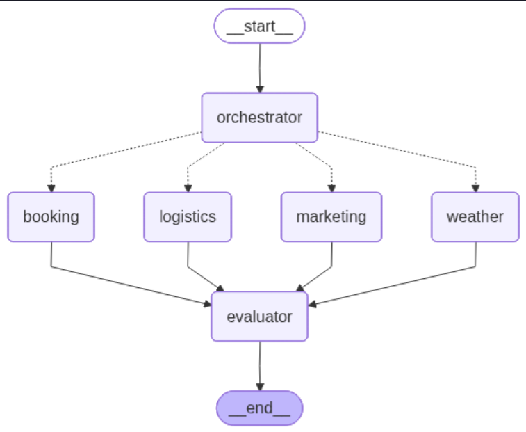

# 🎸 TourMaster AI 
> **Production-Grade Multi-Agent System for Music Tour Management**


TourMaster AI is an intelligent, multi-agent orchestration system designed to automate and optimize the complex logistics of music tour management. Moving beyond simple chatbots, this system leverages a **Directed Acyclic Graph (DAG)** architecture to route natural language queries to specialized AI agents, complete with internal quality assurance and full observability.

## 🧠 Architecture Overview

The project is structured as a modular, production-ready Python application. At the core is **LangGraph**, which maintains state across the conversation and routes tasks conditionally. 



1. **The Orchestrator:** A semantic router utilizing Pydantic v2 structured outputs to classify user intent.
2. **Domain Experts (Nodes):**
   - 📅 **Booking Agent:** Uses RAG to query local vector stores for venues, capacities, and technical specs.
   - 🚐 **Logistics Agent:** Combines RAG with **Tool Calling** (e.g., executing Python functions to calculate travel costs based on distance and fuel consumption).
   - 📣 **Marketing Agent:** Generates press releases and social media copy grounded in internal documentation.
   - 🌦️ **Weather Agent:** Uses external tool binding to fetch and format weather forecasts for outdoor events.
3. **The Evaluator (QA):** Before any response reaches the user, an LLM-as-a-Judge evaluates the answer against the original query, scoring it (1-10) and providing reasoning.

## ✨ Key Features

- **Stateful Multi-Agent Graph:** Built with LangGraph for scalable, predictable, and correctable AI workflows.
- **Retrieval-Augmented Generation (RAG):** Powered by ChromaDB and OpenAI `text-embedding-3-small` for semantic search over proprietary Markdown documents.
- **Advanced Tool Calling:** Agents dynamically execute deterministic Python functions when math or external data is required.
- **Enterprise Observability:** Fully integrated with **Langfuse** for real-time tracing, latency monitoring, token cost calculation, and quality scoring.
- **Modern Dependency Management:** Built and managed using `uv` with a fully configured `pyproject.toml` for deterministic environments and native CLI execution.

## 🛠️ Project Structure
```text
tourmaster-ai/
├── assets/          
├── data/
├── src/
│   ├── __init__.py
│   ├── config.py           
│   ├── graph.py            
│   ├── agents/
│   │   ├── __init__.py
│   │   ├── agents.py       
│   │   └── state.py
│   ├── database/
│   │   ├── __init__.py
│   │   └── db.py           
│   └── tools/
│       ├── __init__.py
│       └── tools.py        
├── main.py                 
└── .env.example
```

## 🚀 Installation & Setup

This project uses `uv` for fast dependency management.

1. **Clone the repository:**
   ```bash
   git clone https://github.com/Pulpoide/tourmaster-ai.git
   cd tourmaster-ai
   ```

2. **Set up the environment with `uv`:**
   ```bash
   uv venv
   source .venv/bin/activate  # On Windows: .venv\Scripts\activate

   uv pip install -r requirements.txt
   ```

3. **Environment Variables:**
   Create a `.env` file in the root directory and add your credentials (NO QUOTES):
   ```env
   OPENAI_API_KEY=sk-...
   LANGFUSE_PUBLIC_KEY=pk-lf-...
   LANGFUSE_SECRET_KEY=sk-lf-...
   LANGFUSE_HOST=https://cloud.langfuse.com
   ```

## 💻 CLI Usage

TourMaster AI operates as a native command-line tool. You can launch the interactive chat or pass direct queries.

```bash
# Interactive console
uv run tourmaster

# Pass a single query directly if you want
uv run tourmaster -q "Listame 5 bares para ir a tocar Jazz en Córdoba"
```

## 🧪 Evaluation & Testing

To ensure the orchestrator's semantic routing remains highly accurate, a dedicated evaluation suite is provided:

```bash
uv run python -m tests.test_router
```

## Author

**Joaquín Olivero** ~ Software Engineer

[](https://www.linkedin.com/in/JoaquinOlivero)
[](https://github.com/Pulpoide)
