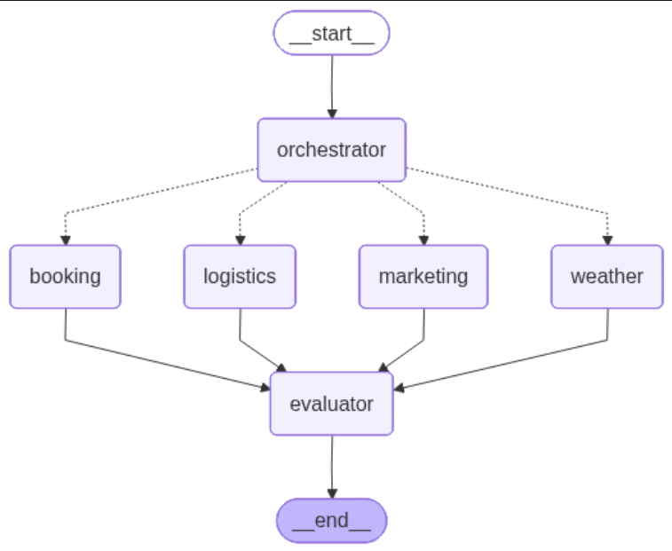

# Tourmaster AI 
<div align="center">
  


</div>

### Multi-Agent System for Music Tour Management — Built with Production Practices

Tourmaster AI is a multi-agent orchestration system that automates logistics for music tour management in Argentina. Originally developed as a Jupyter Notebook proof-of-concept, it was refactored into a modular Python application using a **Directed Acyclic Graph (DAG)** architecture. The system routes natural language queries to specialized AI agents, applies an LLM-as-a-Judge quality gate, and traces every step with full observability.

## Architecture Overview

The project follows a modular graph architecture powered by **LangGraph**, which maintains state across the conversation and routes tasks conditionally.



1. **The Orchestrator:** A semantic router using Pydantic v2 structured outputs to classify user intent into one of four domains.
2. **Domain Experts (Nodes):**
   - **Booking Agent:** Uses RAG to query a local vector store for venues, capacities, and technical specs.
   - **Logistics Agent:** Combines RAG with **Tool Calling** -- executes Python functions to calculate travel costs based on distance and fuel consumption.
   - **Marketing Agent:** Generates press releases and social media copy grounded in internal documentation.
   - **Weather Agent:** Fetches live weather forecasts via OpenWeatherMap API for outdoor event planning.
3. **The Evaluator (QA):** Before any response reaches the user, an LLM-as-a-Judge evaluates the answer against the original query, scoring it (1-10) with reasoning.

## Key Features

- **Stateful Multi-Agent Graph:** LangGraph orchestrates a DAG that routes queries through intent classification, domain-specific agents, and an evaluator — all within a shared conversation state.
- **Retrieval-Augmented Generation (RAG):** ChromaDB vector store with OpenAI `text-embedding-3-small` enables semantic search over local Markdown documents covering venues, logistics, and marketing material.
- **Tool Calling Agents:** Logistics and Weather agents execute deterministic Python functions — travel cost calculations and live OpenWeatherMap forecasts — grounded in real data rather than LLM hallucination.
- **Observability with Langfuse:** End-to-end tracing, latency monitoring, token usage tracking, and automated quality scoring via Langfuse.
- **Reproducible Environments:** Dependency management with `uv` + `pyproject.toml` for deterministic installs and a native CLI entry point.

## Project Structure
```text
tourmaster-ai/
├── assets/          
├── data/
├── src/
│   ├── __init__.py
│   ├── config.py           
│   ├── graph.py            
│   ├── agents/
│   │   ├── __init__.py
│   │   ├── agents.py       
│   │   └── state.py
│   ├── database/
│   │   ├── __init__.py
│   │   └── db.py           
│   └── tools/
│       ├── __init__.py
│       └── tools.py        
├── main.py                 
└── .env.example
```

## Installation & Setup

This project uses `uv` for fast dependency management.

1. **Clone the repository:**
   ```bash
   git clone https://github.com/Pulpoide/tourmaster-ai.git
   cd tourmaster-ai
   ```

2. **Set up the environment with `uv`:**
   ```bash
   uv venv
   source .venv/bin/activate  # On Windows: .venv\Scripts\activate

   uv pip install -r requirements.txt
   ```

3. **Environment Variables:**
   Create a `.env` file in the root directory and add your credentials (NO QUOTES):
   ```env
   OPENAI_API_KEY=sk-...
   LANGFUSE_PUBLIC_KEY=pk-lf-...
   LANGFUSE_SECRET_KEY=sk-lf-...
   LANGFUSE_HOST=https://cloud.langfuse.com
   ```

## CLI Usage

TourMaster AI operates as a native command-line tool. You can launch the interactive chat or pass direct queries.

```bash
# Interactive console
uv run tourmaster

# Pass a single query directly if you want
uv run tourmaster -q "Listame 5 bares para ir a tocar Jazz en Córdoba"
```

## Evaluation & Testing

To ensure the orchestrator's semantic routing remains highly accurate, a dedicated evaluation suite is provided:

```bash
uv run python -m tests.test_router
```

## Author

**Joaquín Olivero** ~ Backend & AI Engineer

[](https://www.linkedin.com/in/JoaquinOlivero)
[](https://github.com/Pulpoide)
